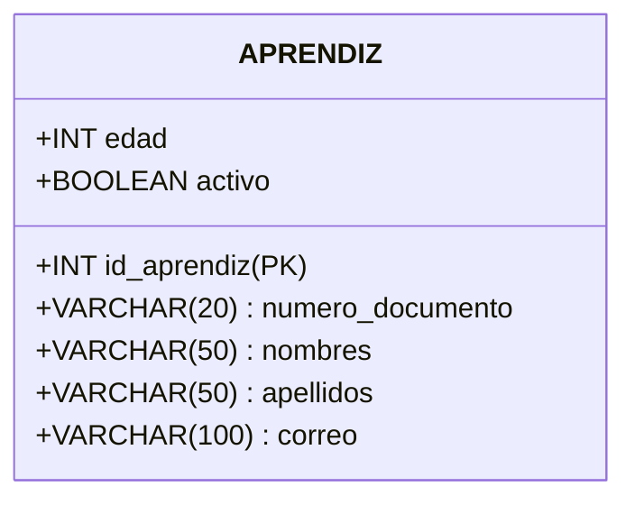

# GUÍA DIDÁCTICA 01: ¿QUÉ ES UNA BASE DE DATOS Y CUÁL ES LA ANATOMÍA DE UNA ENTIDAD?

## Módulo de Fundamentos de Bases de Datos Relacionales (Nivel Cero)

### Ficha 3571501 — Técnico en Procesamiento de Datos para Modelos de Inteligencia Artificial

> **CENTRO:** CENTRO DE DESARROLLO INDUSTRIAL, EMPRESARIAL Y CAMPESINO - CDIEC (Código: 9232)
> **REGIONAL:** Cundinamarca
> **INSTRUCTOR FACILITADOR:** Melqui Alexander Romero Veru
> **COMPETENCIA:** 220501115 — Integración de datos desde múltiples fuentes de datos

---

## 1. El Viaje del Dato a la Inteligencia Artificial

Antes de construir modelos de aprendizaje automático (Machine Learning) o entrenar algoritmos de predicción, debemos responder una pregunta elemental:
**¿De dónde saca la inteligencia la máquina?**

La máquina no piensa por magia; se alimenta de **datos ordenados, limpios y consistentes**. Si le entregamos datos desorganizados, el modelo aprenderá errores (*"Basura entra, basura sale"* o *Garbage In, Garbage Out*).

```
┌─────────────┐       ┌─────────────────┐       ┌─────────────────┐       ┌──────────────────────┐
│  DATO CRUDO │  ──►  │   INFORMACIÓN   │  ──►  │ BASE DE DATOS   │  ──►  │ MODELO DE I.A.       │
│  "28"       │       │ "Edad = 28 años"│       │ Estructura      │       │ Aprende patrones     │
│             │       │ con significado │       │ confiable       │       │ y hace predicciones  │
└─────────────┘       └─────────────────┘       └─────────────────┘       └──────────────────────┘
```

### Definiciones Básicas sin Tecnicismos:

- **Dato:** Es un valor aislado, un símbolo, un número o una palabra sin contexto. Ejemplo: `1073461520` o `38.5`. Por sí solo no nos dice nada.
- **Información:** Es el dato puesto en contexto. Ejemplo: `1073461520` es el número de documento de identidad del instructor Melqui Romero, y `38.5` es la temperatura corporal de un paciente con fiebre.
- **Base de Datos (BD):** Es una colección organizada, estructurada y protegida de información para que pueda ser consultada, actualizada y analizada de manera rápida y segura por sistemas informáticos.

---

## 2. La Gran Pregunta: ¿Por qué Excel NO es una Base de Datos?

Casi todos los aprendices inician guardando datos en hojas de cálculo como Microsoft Excel o Google Sheets. Aunque las hojas de cálculo son herramientas maravillosas para cálculos rápidos o gráficos de oficina, **colapsan cuando intentamos usarlas como repositorio formal de información corporativa o para alimentar sistemas de IA**.

| Característica                          | Hoja de Cálculo (Excel)                                                                                              | Base de Datos Relacional (RDBMS)                                                                                                      |
| :--------------------------------------- | :-------------------------------------------------------------------------------------------------------------------- | :------------------------------------------------------------------------------------------------------------------------------------ |
| **Control de Tipos**               | En una misma columna puedes escribir un número, una palabra y una carita feliz`:)` sin que el programa te detenga. | Cada columna tiene un tipo de dato estricto (ej. solo números enteros). Si intentas meter texto, el sistema lo rechaza de inmediato. |
| **Volumen de Datos**               | Límite estricto de ~1 millón de filas; se vuelve lento e inmanejable con decenas de miles de registros.             | Soporta millones o miles de millones de registros distribuidos con tiempos de respuesta en milisegundos.                              |
| **Seguridad y Acceso Simultáneo** | Si 50 personas abren el archivo al mismo tiempo, los datos se sobreescriben o el archivo se bloquea/daña.            | Miles de usuarios o procesos de IA pueden consultar y escribir simultáneamente sin destruirse entre sí (Concurrencia).              |
| **Evitar Duplicados**              | El usuario puede repetir 100 veces el mismo aprendiz o cambiar el nombre a "Juan", "Juna", "juan perez".              | Aplica**reglas de integridad**: no permite crear aprendices con la misma cédula ni datos huérfanos.                           |

---

## 3. ¿Por qué se llama "Relacional"?

En 1970, un matemático e investigador de IBM llamado **Edgar Frank Codd** propuso una idea revolucionaria: en lugar de almacenar datos en árboles complejos o listas enredadas, los datos debían organizarse en **relaciones matemáticas**, que para el ser humano común tienen la forma más intuitiva del mundo: **Tablas de Filas y Columnas**.

Además, el nombre "relacional" proviene de una segunda propiedad fascinante: **las diferentes tablas se conectan (se relacionan) entre sí a través de identificadores comunes**, evitando que tengamos que repetir los mismos datos una y otra vez.

---

## 4. Anatomía de una Entidad (Tabla)

En la teoría de bases de datos existen términos formales y términos cotidianos. Es vital conocer ambos:

| Término Conceptual         | Término en Base de Datos | Término Cotidiano en Hoja de Cálculo |
| :-------------------------- | :------------------------ | :------------------------------------- |
| **Entidad**           | **Tabla**           | Hoja o Cuadrícula                     |
| **Atributo**          | **Campo / Columna** | Columna (A, B, C...)                   |
| **Tupla / Instancia** | **Registro / Fila** | Fila (1, 2, 3...)                      |
| **Valor Atómico**    | **Dato de Campo**   | Celda individual                       |



### ¿Por qué se llama "Entidad"?

Una **Entidad** proviene del vocablo *ente* (aquello que existe). En el diseño de bases de datos:

> **Una Entidad es cualquier objeto real o conceptual del cual nos interesa recolectar y almacenar información.**

- **Objetos físicos reales:** Un aprendiz, un instructor, un computador del ambiente CV-306, un sensor IoT.
- **Objetos conceptuales o eventos:** Una matrícula, una sesión de formación, una venta, una predicción de un modelo de IA.

---

## 5. Las 5 Partes Fundamentales de una Tabla

Analicemos la siguiente tabla de ejemplo del **CDIEC**:

### Tabla: `aprendices`

| id_aprendiz (PK) | tipo_doc | num_documento |    nombres    |   apellidos   |  correo_institucional  | edad | estado |
| :--------------: | :------: | :-----------: | :------------: | :-----------: | :--------------------: | :--: | :----: |
|   **1**   |    CC    |  1024567890  |  Laura Sofía  | Gómez Pérez | lgomez@soy.sena.edu.co |  21  | ACTIVO |
|   **2**   |    TI    |  1089234567  | Carlos Andrés | Meza Rincón | cmeza@soy.sena.edu.co |  17  | ACTIVO |

Examinemos cada una de sus partes:

### 1. El Nombre de la Entidad (Encabezado)

- **Regla pedagógica:** El nombre debe representar claramente qué tipo de objetos hay adentro.
- **Buena práctica técnica:** Usar sustantivos en plural o singular consistente (ej. `aprendiz` o `aprendices`), en minúsculas y sin espacios (`snake_case`: `sensor_temperatura`, `resultado_evaluacion`). Nunca use caracteres especiales como `ñ` o tildes.

### 2. Atributos (Columnas o Campos)

Son las características o propiedades que describen a la entidad. Cada columna define una propiedad específica.

- *Ejemplo en `aprendices`:* El documento, el nombre, el correo y la edad son atributos.
- **Regla de oro de los atributos:** Deben ser **atómicos** (indivisibles).
  *Mal diseño:* Una columna llamada `nombre_completo_y_direccion`.
  *Buen diseño:* Columnas separadas `nombres`, `apellidos`, `direccion`.

### 3. Registros (Filas o Tuplas)

Cada fila horizontal representa **un único individuo u objeto específico** del mundo real.

- La fila 1 representa exclusivamente a la aprendiz *Laura Sofía Gómez Pérez*.
- Cada fila es independiente de las demás, pero todas comparten exactamente la misma estructura de columnas.

### 4. Dominio y Tipos de Datos Primitivos

Cada columna debe tener un tipo de dato definido. Los principales en bases de datos relacionales son:

| Tipo de Dato              | ¿Para qué sirve?                                                       | Ejemplos en la vida real                                   |
| :------------------------ | :----------------------------------------------------------------------- | :--------------------------------------------------------- |
| **VARCHAR / TEXT**  | Cadenas de texto alfanumérico (letras, números como texto, símbolos). | `'Laura Sofía'`, `'Carrera 7 # 12-40'`                |
| **INT / INTEGER**   | Números enteros sin decimales.                                          | `21` (edad), `5` (número de hijos), `100` (puntaje) |
| **DECIMAL / FLOAT** | Números con coma decimal (precisión real).                             | `38.45` (temperatura), `95.50` (promedio ponderado)    |
| **DATE / DATETIME** | Fechas y marcas de tiempo cronológicas.                                 | `'2026-10-09'`, `'2026-10-09 14:30:00'`                |
| **BOOLEAN**         | Valores lógicos binarios: Verdadero o Falso (1 o 0).                    | `TRUE` (activo), `FALSE` (desertado)                   |

> [!WARNING]
> **Pregunta trampa para aprendices:** ¿El número de teléfono o la cédula de ciudadanía deben ser de tipo `INT` (entero)?
> **Respuesta correcta:** ¡No necesariamente! Si un campo numérico no se va a sumar, restar o promediar, y puede empezar por cero (como un celular `031...`), es mucho más seguro tratarlo como texto (`VARCHAR`).

### 5. El Concepto de Valor NULO (`NULL`)

El valor `NULL` es uno de los conceptos más malinterpretados en la informática:

- **`NULL` NO es un cero (`0`):** Un saldo bancario en `0` significa que no tienes dinero. Un saldo `NULL` significa que *no sabemos* cuánto dinero tienes.
- **`NULL` NO es un texto vacío (`""`):** Un correo vacío significa que el usuario escribió algo en blanco. Un correo `NULL` significa que el valor está ausente, no aplica o es desconocido.
- **En Inteligencia Artificial:** Los valores `NULL` representan *datos faltantes* (Missing Values) que deben ser imputados o tratados en la fase de limpieza (ETL).

---

## 6. Diagrama de la Anatomía Visual

```
                     COLUMNAS / ATRIBUTOS / CAMPOS
                                 │
         ┌───────────────────────┼───────────────────────────┐
         ▼                       ▼                           ▼
┌──────────────────┬───────────────────────────┬───────────────────────────┐
│ id_aprendiz (PK) │ nombres                   │ edad                      │ ◄── ENCABEZADOS
├──────────────────┼───────────────────────────┼───────────────────────────┤
│ 1                │ Laura                     │ 21                        │ ◄── FILA 1 (Registro / Tupla)
├──────────────────┼───────────────────────────┼───────────────────────────┤
│ 2                │ Carlos                    │ 17                        │ ◄── FILA 2 (Registro / Tupla)
├──────────────────┼───────────────────────────┼───────────────────────────┤
│ 3                │ Valentina                 │ 24                        │ ◄── FILA 3 (Registro / Tupla)
└──────────────────┴───────────────────────────┴───────────────────────────┘
                                                       ▲
                                                       │
                                                CELDA INDIVIDUAL (Valor atómico: 24)
```

---

## 7. Preguntas de Reflexión y Debate para la Sesión

1. Si quisiéramos diseñar una tabla para los computadores del ambiente de formación CV-306 del CDIEC:
   - ¿Cuál sería el nombre de la entidad?
   - Mencione 5 atributos indispensables para esa entidad.Ñ
   - ¿Qué tipo de dato tendría cada atributo?
2. ¿Por qué es un error guardar la fecha de nacimiento y la edad en dos columnas diferentes de la misma tabla?*(Pista pedagógica: ¿Qué pasa con la edad cuando el aprendiz cumple años el próximo año?).*
3. En un dataset para predecir si un aprendiz abandonará sus estudios (modelo de IA predictivo), ¿qué atributos de la tabla `aprendices` podrían ser relevantes?
