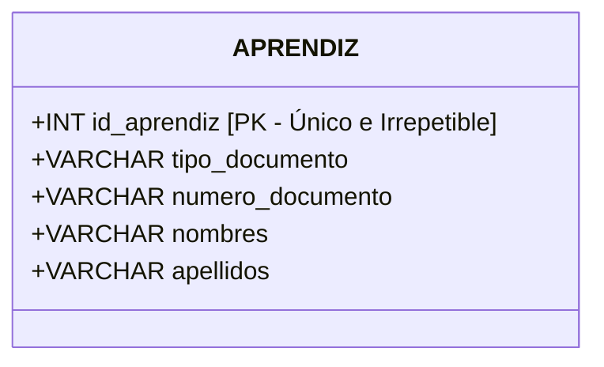
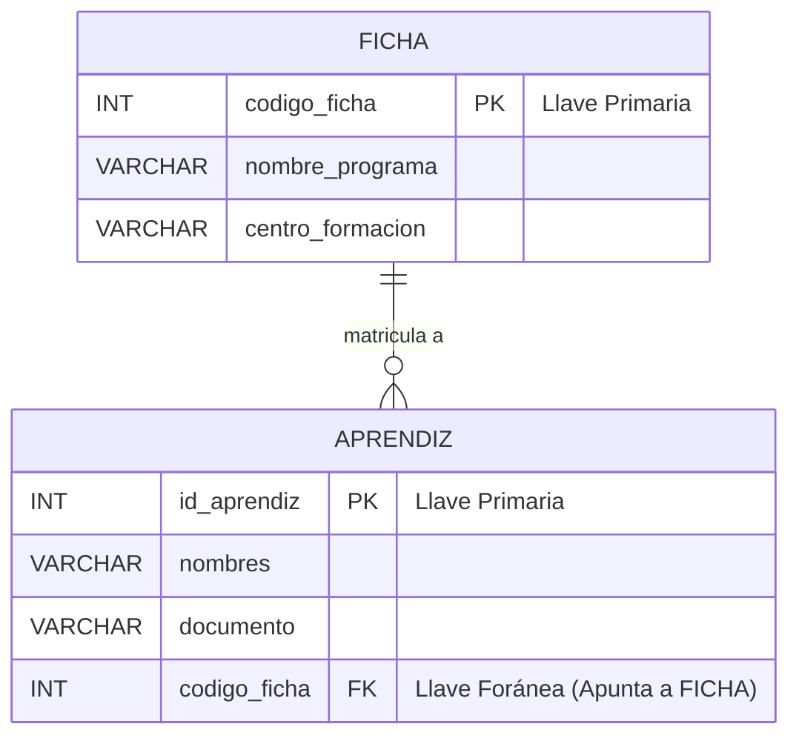

# GUÍA DIDÁCTICA 02: LLAVES PRIMARIAS, LLAVES FORÁNEAS E INTEGRIDAD REFERENCIAL

## Módulo de Fundamentos de Bases de Datos Relacionales (Nivel Cero)

### Ficha 3571501 — Técnico en Procesamiento de Datos para Modelos de Inteligencia Artificial

> **CENTRO:** CENTRO DE DESARROLLO INDUSTRIAL, EMPRESARIAL Y CAMPESINO - CDIEC (Código: 9232)
> **REGIONAL:** Cundinamarca
> **INSTRUCTOR FACILITADOR:** Melqui Alexander Romero Veru
> **COMPETENCIA:** 220501115 — Integración de datos desde múltiples fuentes de datos

---

## 1. El Dilema de la Identidad en el Mundo Real

Imagine la siguiente situación en el **CDIEC**:
En la ficha 3571501 se matriculan dos aprendices con el mismo nombre y apellido: **"Camilo Andrés Rodríguez"**. Ambos tienen la misma edad (18 años) y viven en el mismo municipio (Soacha).

- Si el instructor pasa asistencia diciendo únicamente *"¡Camilo Rodríguez!"*, ambos responderán al tiempo.
- Si el sistema del SENA intenta subir una nota a *"Camilo Rodríguez"*, ¿a cuál de los dos se la asigna?

Para resolver esta ambigüedad, la sociedad inventó identificadores únicos:

- La Registraduría Nacional utiliza el **Número de Documento de Identidad (Cédula de Ciudadanía)**.
- El SENA asigna un **Número de Ficha** y un **ID de Aprendiz**.
- Los bancos asignan un **Número de Cuenta**.
- Los productos de supermercado tienen un **Código de Barras**.

> En una Base de Datos Relacional, este identificador único e irrepetible se denomina **Llave Primaria (Primary Key - PK)**.

---

## 2. Llave Primaria (Primary Key - PK)

Una **Llave Primaria** es una columna (o conjunto de columnas) que identifica de forma **única, precisa e inequívoca** cada fila de una tabla. Jamás pueden existir dos filas con el mismo valor en su llave primaria.



### Las 3 Reglas de Oro de una Llave Primaria (PK):

```
       ┌────────────────────────────────────────────────────────┐
       │             REGLAS SAGRADAS DE UNA LLAVE PK            │
       └────────────────────────────────────────────────────────┘
            │                     │                     │
            ▼                     ▼                     ▼
     1. UNICIDAD          2. NUNCA NULA          3. INMUTABLE
    No pueden existir      Siempre debe tener    No debe cambiar a lo
    dos filas con el       un valor conocido.    largo de la vida
    mismo ID.             (NOT NULL obligatorio) del registro.
```

### Llave Natural vs. Llave Subrogada (Artificial)

Existen dos maneras de elegir una Llave Primaria:

1. **Llave Natural:** Un atributo que ya existe en el mundo real y es único por naturaleza.*Ejemplo:* El número de cédula de ciudadanía (`1073672380`) o la placa de un vehículo (`ABC-123`).
   - *Problema común:* ¿Qué pasa cuando un aprendiz venezolano ingresa con Permiso de Protección Temporal (PPT) y luego le expiden cédula de extranjería? ¿O cuando un joven pasa de Tarjeta de Identidad (TI) a Cédula de Ciudadanía (CC)? Cambiar la llave primaria en cascada es peligroso.
2. **Llave Subrogada (Recomendada en ingeniería de datos):** Un identificador numérico artificial generado automáticamente por el sistema (Autoincremental: 1, 2, 3, 4...).*Ejemplo:* `id_aprendiz = 101`.
   - Si el aprendiz cambia su número de documento o corrige una letra de su apellido, el `id_aprendiz` jamás cambia. El sistema permanece blindado.

---

## 3. ¿Cómo Conectar Tablas sin Duplicar Información?

Imaginemos que tenemos dos entidades en nuestro ambiente de formación:

1. **`fichas`:** Información del programa formativo (Ficha 3571501, CDIEC, Técnico en IA).
2. **`aprendices`:** Información personal de los 30 aprendices.

### El Error del Principiante (Diseño Caótico tipo Hoja de Cálculo):

Meter todos los datos del programa dentro de cada fila del aprendiz:

| id_aprendiz | nombre           | ficha_codigo | ficha_programa               | ficha_centro | ficha_regional |
| :---------: | :--------------- | :----------: | :--------------------------- | :----------- | :------------- |
|      1      | Laura Gómez     |   3571501   | Téc. Procesamiento Datos IA | CDIEC (9232) | Cundinamarca   |
|      2      | Carlos Meza      |   3571501   | Téc. Procesamiento Datos IA | CDIEC (9232) | Cundinamarca   |
|      3      | Valentina Torres |   3571501   | Téc. Procesamiento Datos IA | CDIEC (9232) | Cundinamarca   |

¿Por qué este diseño es pésimo?

- **Desperdicio de memoria:** Repetimos el texto del programa y centro 30 veces.
- **Peligro de inconsistencia:** Si el nombre del centro cambia o alguien escribe por error *"CIDE"* en lugar de *"CDIEC"*, la base de datos queda corrupta y contaminada.

### La Solución Relacional: La Llave Foránea (Foreign Key - FK)

Separamos la información en dos tablas limpias:

1. La tabla `fichas` guarda los datos del grupo una sola vez.
2. La tabla `aprendices` solo guarda un "puntero" o "número de referencia": el `id_ficha`.



---

## 4. ¿Qué es una Llave Foránea (Foreign Key - FK)?

> Una **Llave Foránea (FK)** es una columna en una tabla secundaria cuyo valor proviene y hace referencia directa a la **Llave Primaria (PK)** de otra tabla principal.

### Metáfora del Casillero o Ticket de Ropa:

Cuando vas a un guardarropa en un evento, no te cosen tu nombre en la maleta ni la maleta en tu camisa.
Te entregan una ficha de plástico con el número **`#42`**.
Ese número `#42` es una **Llave Foránea**: relaciona a la persona con su casillero de manera inmediata sin duplicar nada.

### Tablas Conectadas en Detalle:

#### Tabla Padre (Principal): `fichas`

| codigo_ficha (PK) | nombre_programa                    | ambiente_principal |
| :---------------: | :--------------------------------- | :----------------: |
| **3571501** | Procesamiento de Datos IA          |       CV-306       |
| **2894102** | Análisis y Desarrollo de Software |       CV-309       |

#### Tabla Hija (Secundaria): `aprendices`

| id_aprendiz (PK) | nombres        | apellidos      |                    codigo_ficha (FK)                    |
| :--------------: | :------------- | :------------- | :------------------------------------------------------: |
|        1        | Laura Sofía   | Gómez Pérez  |                 **3571501** ──┐                 |
|        2        | Carlos Andrés | Meza Rincón   | **3571501** ──┼──► Apuntan a la ficha de IA |
|        3        | Andrés Felipe | Castro Morales | **2894102** ─────► Apunta a la ficha de ADSO |

---

## 5. Integridad Referencial: Las Reglas de Seguridad

La **Integridad Referencial** es la garantía de que las relaciones entre tablas siempre son válidas, consistentes y no contienen "punteros rotos".

### Caso de Error 1: El Registro Huérfano / Puntero Fantasma

¿Qué ocurre si intentamos matricular a un nuevo aprendiz en la tabla secundaria con la ficha `9999999` (una ficha que no existe en la tabla `fichas`)?

```
[aprendices]
id_aprendiz: 4
nombres: "Mariana Silva"
codigo_ficha: 9999999  <── ¡ERROR FATAL DE INTEGRIDAD REFERENCIAL!
```

El motor de base de datos relacional **bloquea la operación** e informa:

> *"No se puede insertar el registro: La llave foránea 9999999 no existe en la tabla de referencia 'fichas'."*

### Caso de Error 2: Eliminación Peligrosa

¿Qué ocurre si el coordinador del centro intenta eliminar la ficha `3571501` de la tabla `fichas`, pero todavía hay 30 aprendices matriculados en ella?
Si el sistema permitiera borrarla, esos 30 aprendices quedarían "huérfanos" (apuntando a la nada).

Para resolver esto, existen tres políticas de eliminación configurables:

1. **RESTRICT / NO ACTION (Por defecto):** Prohíbe borrar la ficha padre mientras tenga aprendices asociados. (La más segura).
2. **CASCADE (En Cascada):** Si borras la ficha padre, el sistema borra automáticamente a todos sus aprendices asociados. *(¡Extremadamente peligrosa si se usa por descuido!).*
3. **SET NULL:** Si borras la ficha, la columna `codigo_ficha` de los aprendices se convierte en `NULL` (quedan sin ficha asignada temporalmente).

---

## 6. Resumen Comparativo: PK vs. FK

| Criterio                               | Llave Primaria (PK)                                    | Llave Foránea (FK)                                                                                         |
| :------------------------------------- | :----------------------------------------------------- | :---------------------------------------------------------------------------------------------------------- |
| **Propósito**                   | Identificar una fila única dentro de su propia tabla. | Conectar una fila con un registro de otra tabla.                                                            |
| **¿Puede repetirse?**           | **JAMÁS**. Cada valor debe ser único.          | **SÍ**. Varios aprendices pueden tener la misma ficha `3571501`.                                   |
| **¿Puede ser NULA (`NULL`)?** | **NUNCA**. Obligatoriamente `NOT NULL`.        | **SÍ**, en casos donde la relación sea opcional (ej. un aprendiz que aún no tiene ficha asignada). |
| **Número por tabla**            | Solo UNA Llave Primaria por tabla.                     | Puede haber MÚLTIPLES llaves foráneas en una misma tabla.                                                 |

---

## 7. Reto de Detección de Errores para el Ambiente de Clase

Pida a los aprendices analizar la siguiente tabla y encontrar **los 3 errores de diseño e integridad**:

#### Tabla: `pedidos_tienda`

| id_pedido (PK) | cliente_cedula | producto          | precio | id_pedido_duplicado |
| :------------: | :------------: | :---------------- | :----: | :-----------------: |
|      101      |    1024567    | Arroz Diana 1kg   |  4500  |         101         |
|      102      |      NULL      | Aceite Premier 1L | 12000 |         102         |
|      101      |    1098765    | Leche Alquería   |  3800  |         103         |
|      NULL      |    1034567    | Huevos AA x 30    | 18000 |         104         |

*(Guía para el facilitador: Fila 3 repite el PK 101; Fila 4 tiene PK NULL; Fila 2 tiene cliente nulo si la compra exige cliente registrado).*
