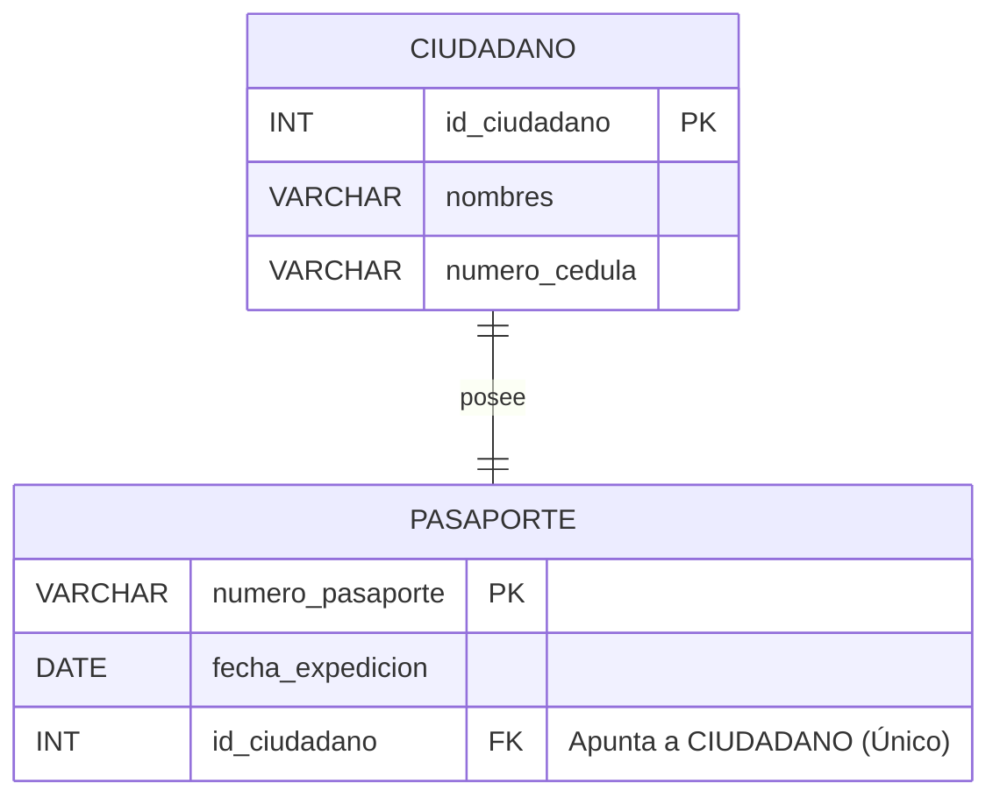
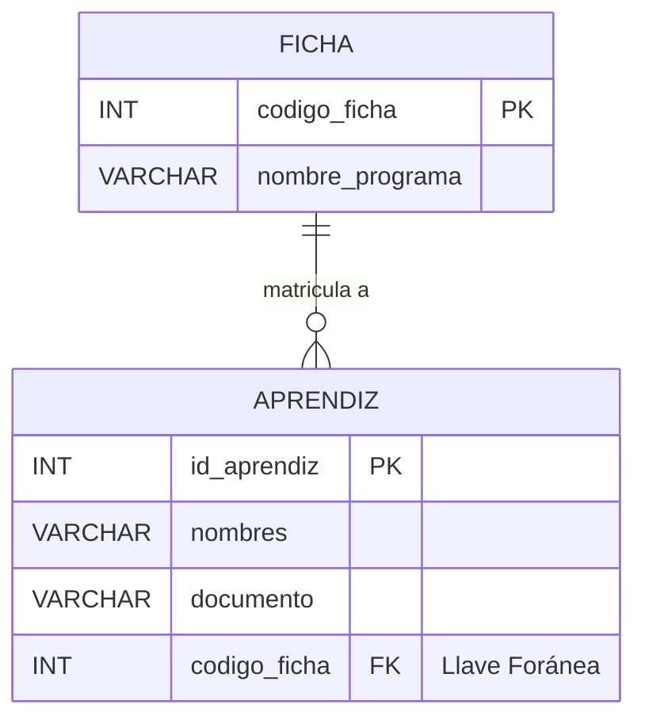
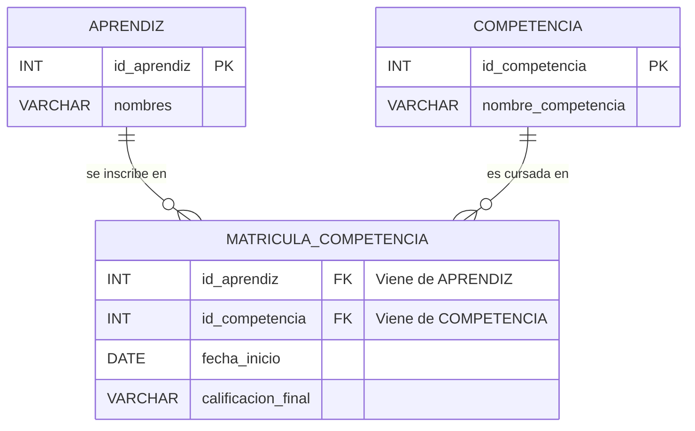
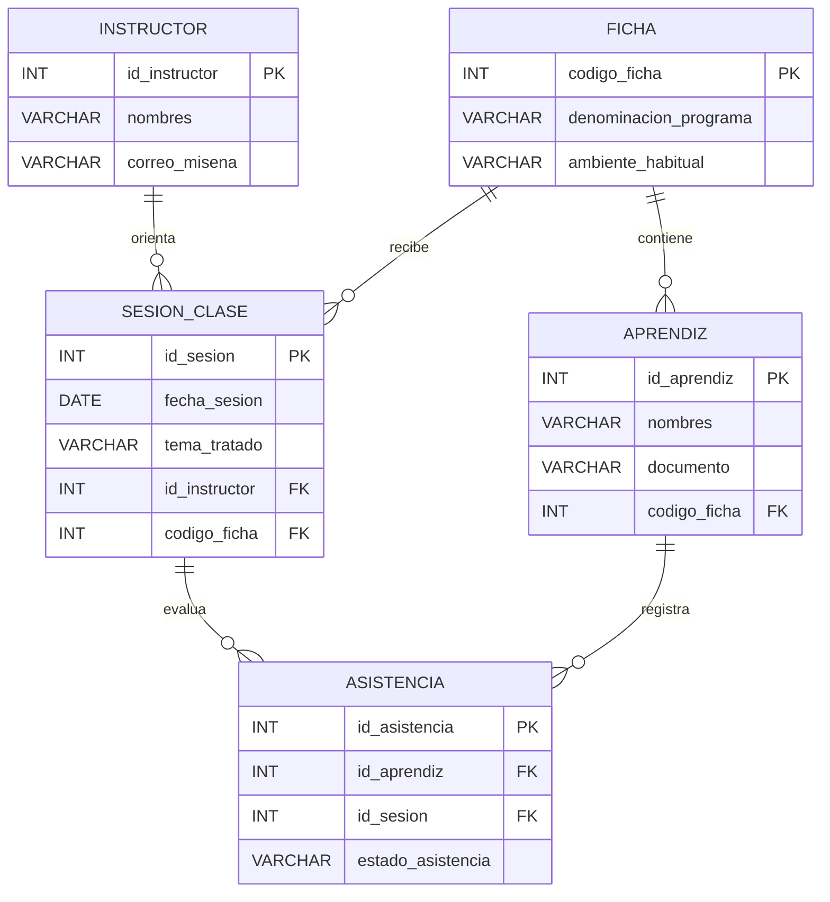

## GUÍA DIDÁCTICA 03: RELACIONES, CARDINALIDADES Y MODELO ENTIDAD-RELACIÓN (MER)

## Módulo de Fundamentos de Bases de Datos Relacionales (Nivel Cero)

### Ficha 3571501 — Técnico en Procesamiento de Datos para Modelos de Inteligencia Artificial

> **CENTRO:** CENTRO DE DESARROLLO INDUSTRIAL, EMPRESARIAL Y CAMPESINO - CDIEC (Código: 9232)
> **REGIONAL:** Cundinamarca
> **INSTRUCTOR FACILITADOR:** Melqui Alexander Romero Veru
> **COMPETENCIA:** 220501115 — Integración de datos desde múltiples fuentes de datos

---

## 1. El Concepto de Relación en el Mundo Real

En la vida cotidiana, las cosas nunca existen aisladas:

- Un **aprendiz** pertenece a una **ficha**.
- Un **cliente** realiza un **pedido**.
- Un **sensor** envía lecturas a un **dispositivo concentrador**.
- Un **médico** atiende a un **paciente**.

En una base de datos relacional:

> Una **Relación** es una asociación lógica y formal entre dos o más entidades (tablas) que refleja cómo interactúan en el negocio o proceso real.

Para definir una relación con precisión milimétrica, debemos medir su **Cardinalidad**.

---

## 2. ¿Qué es la Cardinalidad?

La **Cardinalidad** responde a dos preguntas fundamentales:

1. *¿Con cuántos elementos de la Tabla B se puede relacionar un elemento de la Tabla A?*
2. *¿Con cuántos elementos de la Tabla A se puede relacionar un elemento de la Tabla B?*

Existen exactamente **tres tipos universales de relaciones**.

---

## 3. Las Tres Cardinalidades Universales

```
┌────────────────────────────────────────────────────────────────────────┐
│                   LOS TRES TIPOS DE CARDINALIDAD                       │
├────────────────────┬─────────────────────────────┬─────────────────────┤
│ 1. UNO A UNO (1:1) │ 2. UNO A MUCHOS (1:N)       │ 3. MUCHOS A MUCHOS  │
│                    │ (El más común de todos)     │    (N:M)            │
└────────────────────┴─────────────────────────────┴─────────────────────┘
```

---

### Tipo 1: Relación Uno a Uno (1:1)

**Definición:**
Un registro de la Tabla A se relaciona con **como máximo un solo registro** de la Tabla B, y viceversa.

**Ejemplos de la vida real:**

- Un **Ciudadano** tiene un único **Pasaporte Vigente**; y ese pasaporte pertenece a un único ciudadano.
- Un **Aprendiz** tiene una única **Hoja de Vida Médica** en bienestar del CDIEC.
- Un **País** tiene una única **Capital**.



> **¿Dónde va la Llave Foránea (FK)?**
> Puede colocarse en cualquiera de las dos tablas. Sin embargo, la buena práctica pedagógica indica colocarla en la tabla secundaria que dependa cronológicamente de la primera (primero nace el ciudadano, luego se le expide el pasaporte).

---

### Tipo 2: Relación Uno a Muchos (1:N)

**Definición:**
Un registro de la Tabla A puede estar asociado con **muchos registros** de la Tabla B. Pero cada registro de la Tabla B se asocia con **uno y solo un registro** de la Tabla A.

**Ejemplos de la vida real:**

- Una **Ficha** tiene matriculados a **muchos Aprendices**, pero cada aprendiz pertenece a una sola ficha activa.
- Un **Cliente** realiza **muchos Pedidos**, pero cada pedido pertenece a un solo cliente.
- Una **Categoría de Producto** (ej. "Lácteos") agrupa a **muchos Productos**, pero el yogurt pertenece a una sola categoría.
- Un **Sensor IoT** genera **miles de Lecturas de Telemetría**, pero cada lectura proviene de un único sensor.



> [!IMPORTANT]
> ### ¡LA REGLA DE ORO PEDAGÓGICA DEL 1:N!
>
> **"La Llave Foránea (FK) SIEMPRE se coloca en el lado del MUCHOS (la tabla secundaria / hija)."**
>
> *¿Por qué no al revés?*
> Si intentáramos poner la llave foránea en `fichas`, tendríamos que escribir en una sola celda: `aprendices: [1, 2, 3, 4, 5, 6, 7...]`.
> ¡Eso rompería la regla del valor atómico y crearía un desastre informático! En cambio, al poner `codigo_ficha` en cada aprendiz, cada celda guarda un único número limpio.

---

### Tipo 3: Relación Muchos a Muchos (N:M)

**Definición:**
Un registro de la Tabla A puede relacionarse con **muchos registros** de la Tabla B, **Y** un registro de la Tabla B puede relacionarse con **muchos registros** de la Tabla A.

**Ejemplos de la vida real:**

- Un **Aprendiz** cursa **muchas Competencias**, y una **Competencia** es cursada por **muchos Aprendices**.
- Un **Cliente** compra **muchos Productos**, y un **Producto** es comprado por **muchos Clientes**.
- Un **Médico** atiende a **muchos Pacientes**, y un **Paciente** es atendido por **muchos Médicos**.
- Un **Artículo de Blog** tiene **muchas Etiquetas (Tags)**, y una **Etiqueta** se aplica a **muchos Artículos**.

### El Gran Problema Técnico: ¿Dónde ponemos la Llave Foránea?

- Si ponemos la FK en la Tabla A: no cabe, porque son muchos.
- Si ponemos la FK en la Tabla B: tampoco cabe, porque son muchos.
- **Conclusión de oro:** Las bases de datos relacionales **NO pueden conectar directamente dos tablas en relación Muchos a Muchos sin ayuda**.

---

## 4. La Solución Maestra: La Tabla Intermedia (Tabla Puente / Tabla Asociativa)

Para resolver una relación N:M, debemos **romperla** creando una **tercera tabla en el medio**.
Esta tabla transforma una relación N:M imposible en **dos relaciones 1:N limpias y perfectas**.



### ¿Qué contiene la Tabla Intermedia?

1. **La Llave Foránea de la Tabla A (`id_aprendiz`).**
2. **La Llave Foránea de la Tabla B (`id_competencia`).**
3. **Atributos propios del encuentro entre ambas entidades:**
   - ¿Cuándo ocurrió la inscripción? (`fecha_matricula`)
   - ¿Qué nota sacó? (`calificacion`)
   - En una factura: ¿Cuántas unidades compró? (`cantidad`) y ¿a qué precio se vendió en ese momento? (`precio_unitario`).

#### Tabla Intermedia en la Práctica: `matricula_competencia`

| id_aprendiz (FK) |     id_competencia (FK)     | fecha_matricula | calificacion |
| :--------------: | :-------------------------: | :-------------: | :-----------: |
| 1 (Laura Gómez) | 101 (Integración de Datos) |   2026-10-02   |   APROBADO   |
| 1 (Laura Gómez) | 102 (Matemáticas para IA) |   2026-10-02   | EN FORMACIÓN |
| 2 (Carlos Meza) | 101 (Integración de Datos) |   2026-10-02   |   APROBADO   |
|  3 (Valentina)  | 102 (Matemáticas para IA) |   2026-10-02   |   APROBADO   |

*¡Fíjense cómo se combinan sin que ninguna celda tenga listas ni información repetida!*

---

## 5. Notación Visual: "Pata de Gallo" (Crow's Foot)

Cuando los ingenieros y analistas de datos dibujan diagramas relacionales, utilizan los símbolos en los extremos de las líneas:

```
    SIMBOLO        SIGNIFICADO
    ─────────      ───────────────────────────────────────
    ──||───        Uno y exactamente uno (Obligatorio)
    ──o|───        Cero o uno (Opcional)
    ──}|───        Uno o muchos (Obligatorio múltiple)
    ──}o───        Cero o muchos (Opcional múltiple - "Pata de Gallo")
```

---

## 6. Caso de Estudio Completo: Modelo de Formación CDIEC

Veamos cómo se integran las entidades que conocemos en el contexto institucional del SENA:



---

## 7. Preguntas de Verificación para el Grupo

1. En una biblioteca: ¿Cuál es la cardinalidad entre la entidad `LIBRO` y la entidad `AUTOR`? ¿Un autor escribe un solo libro o muchos? ¿Un libro puede tener varios coautores? ¿Qué tipo de relación es?
2. Si un hospital tiene `MEDICO` y `CONSULTORIO`, y cada médico tiene su propio consultorio asignado de forma fija, ¿qué cardinalidad tiene?
3. ¿Por qué es un error grave intentar modelar la venta de productos en un supermercado sin crear una tabla intermedia como `detalle_factura`?
