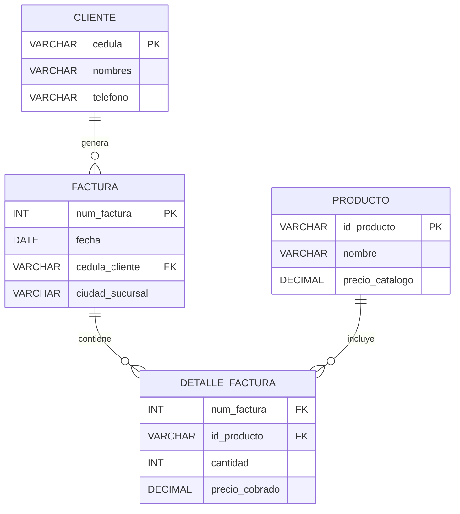

# GUÍA DIDÁCTICA 04: NORMALIZACIÓN INTUITIVA (1FN, 2FN, 3FN)

## De la "Hoja de Cálculo Caótica" a una Base de Datos Relacional Limpia

### Ficha 3571501 — Técnico en Procesamiento de Datos para Modelos de Inteligencia Artificial

> **CENTRO:** CENTRO DE DESARROLLO INDUSTRIAL, EMPRESARIAL Y CAMPESINO - CDIEC (Código: 9232)
> **REGIONAL:** Cundinamarca
> **INSTRUCTOR FACILITADOR:** Melqui Alexander Romero Veru
> **COMPETENCIA:** 220501115 — Integración de datos desde múltiples fuentes de datos

---

## 1. ¿Qué es la Normalización y por qué Existe?

La palabra **Normalización** suena intimidante y matemática, pero en la práctica es simplemente:

> **El arte de organizar las tablas para que cada dato se guarde una sola vez, en el lugar correcto, sin redundancias ni contradicciones.**

### Metáfora del Armario de Ropa:

Imagine que en un solo cajón mete camisas, zapatos sucios, documentos importantes, comida y herramientas.

- Cada vez que busca algo, pierde tiempo.
- Si se riega algo, daña la ropa.
- Si compra un par de zapatos nuevo, no sabe dónde ponerlo.
  **Normalizar** es comprar organizadores: los zapatos van en el zapatero, la ropa colgada en ganchos y los documentos en una carpeta archivadora. Cada cosa en su lugar.

---

## 2. Los 3 Desastres de No Normalizar (Anomalías de Datos)

Si guardamos todo en una sola tabla gigante (como la típica hoja de Excel de oficina), sufriremos tres anomalías mortales para cualquier proyecto de analítica o Inteligencia Artificial:

```
┌────────────────────────────────────────────────────────────────────────┐
│                      LAS TRES ANOMALÍAS DESTRUCTIVAS                   │
├────────────────────┬─────────────────────────────┬─────────────────────┤
│ 1. INSERCIÓN       │ 2. ACTUALIZACIÓN            │ 3. ELIMINACIÓN      │
│ No puedes crear un │ Cambias el teléfono de un   │ Borras una factura  │
│ producto si nadie  │ cliente y debes editar 500  │ vieja y ¡borras sin │
│ lo ha comprado aún.│ filas. Si olvidas una, los  │ querer a todo un    │
│                    │ datos quedan corruptos.     │ cliente o producto! │
└────────────────────┴─────────────────────────────┴─────────────────────┘
```

---

## 3. El Caso de Estudio: La "Mega-Tabla Desastre"

Observemos la siguiente tabla donde una tienda de tecnología intenta registrar sus ventas en una sola cuadrícula:

### Tabla NO Normalizada: `ventas_caoticas`

| num_factura |   fecha   | cliente_nombre | cliente_telefonos      | productos_comprados                              | tienda_ciudad | ciudad_clima |
| :---------: | :--------: | :------------- | :--------------------- | :----------------------------------------------- | :------------ | :----------- |
|    1001    | 2026-10-09 | Carlos Pérez  | 3101234567, 3209876543 | Laptop HP ($2.500.000), Mouse Logitech ($60.000) | Soacha        | Frío        |
|    1002    | 2026-10-09 | Carlos Pérez  | 3101234567             | Teclado Mecánico ($180.000)                     | Soacha        | Frío        |
|    1003    | 2026-10-10 | Diana Gómez   | 3154567890             | Mouse Logitech ($60.000)                         | Girardot      | Cálido      |

¿Qué problemas saltan a la vista?

1. En `cliente_telefonos` y `productos_comprados` hay múltiples valores separados por comas y paréntesis.
2. Si Carlos Pérez cambia de número, ¿en cuántas filas hay que buscarlo?
3. La ciudad y el clima se repiten innecesariamente en cada venta.
4. ¿Cómo sumaría una Inteligencia Artificial el total vendido si el precio está metido dentro de un texto entre paréntesis? ¡Es imposible procesar!

---

## 4. Primera Forma Normal (1FN): Regla de la Atomicidad

> **Regla de 1FN:**
>
> 1. Cada celda debe contener **un único valor indivisible (atómico)**. Cero listas o conjuntos de valores.
> 2. Cada columna debe tener un tipo de dato consistente.
> 3. La tabla debe tener una **Llave Primaria (PK)** claramente identificada.

```
┌────────────────────────────────────────┐
│               ANTES (MAL)              │
│ cliente_telefonos: "310123, 320987"    │
└────────────────────────────────────────┘
                   │
                   ▼ (Aplicando 1FN)
┌────────────────────────────────────────┐
│              DESPUÉS (BIEN)            │
│  Fila 1: Telefono = 310123             │
│  Fila 2: Telefono = 320987             │
└────────────────────────────────────────┘
```

### Aplicando 1FN a nuestro caso:

Desglosamos los productos en filas individuales y separamos nombres de precios:

| num_factura | cliente_cedula | producto_id | nombre_producto   | precio_unitario | cantidad | tienda_ciudad |
| :---------: | :------------: | :---------: | :---------------- | :-------------: | :------: | :------------ |
|    1001    |     102030     |   PROD-1   | Laptop HP         |     2500000     |    1    | Soacha        |
|    1001    |     102030     |   PROD-2   | Mouse Logitech    |      60000      |    1    | Soacha        |
|    1002    |     102030     |   PROD-3   | Teclado Mecánico |     180000     |    1    | Soacha        |
|    1003    |     405060     |   PROD-2   | Mouse Logitech    |      60000      |    1    | Girardot      |

*¡Ya tenemos valores atómicos! Pero todavía hay repetición: `Laptop HP` y su precio aparecen atados a la factura.*

---

## 5. Segunda Forma Normal (2FN): Regla de Dependencia Total

> **Regla de 2FN:**
>
> 1. Cumplir con la **1FN**.
> 2. Todos los atributos que no forman parte de la llave primaria deben depender de **TODA la llave primaria**, no de una parte de ella (aplica especialmente en tablas con llaves primarias compuestas).

En la tabla anterior, la llave de una fila de venta es la combinación `(num_factura + producto_id)`:

- ¿La `cantidad` depende de la factura y del producto? **SÍ** (¿cuántos mouses compré en la factura 1001?).
- ¿El `nombre_producto` depende del número de factura? **NO**. El Mouse Logitech se llama Mouse Logitech sin importar si está en la factura 1001, en la 1003 o guardado en bodega.

### Aplicando 2FN: Separamos en Entidades Independientes

Creamos la tabla independiente de **`productos`**:

#### Tabla `productos`:

| id_producto (PK) | nombre_producto   | precio_unitario |
| :--------------: | :---------------- | :-------------: |
|      PROD-1      | Laptop HP         |     2500000     |
|      PROD-2      | Mouse Logitech    |      60000      |
|      PROD-3      | Teclado Mecánico |     180000     |

#### Tabla Intermedia `detalle_factura`:

| num_factura (FK) | id_producto (FK) | cantidad |
| :--------------: | :--------------: | :------: |
|       1001       |      PROD-1      |    1    |
|       1001       |      PROD-2      |    1    |
|       1002       |      PROD-3      |    1    |
|       1003       |      PROD-2      |    1    |

---

## 6. Tercera Forma Normal (3FN): Cero Dependencias Transitivas

> **Regla de 3FN:**
>
> 1. Cumplir con la **2FN**.
> 2. Ningún atributo no-llave debe depender de otro atributo no-llave.
>
> *El mantra célebre de Bill Kent:*
> **"Cada atributo debe depender de la llave, de toda la llave y de nada más que de la llave."**

En la tabla de facturas aún teníamos: `tienda_ciudad` y `ciudad_clima`.

- El clima no depende de la factura; el clima depende de la ciudad.
- Si la tienda abre 1.000 facturas en Soacha, repetiríamos 1.000 veces que Soacha tiene clima frío.
- Si mañana cambia la clasificación climática, tendríamos que actualizar 1.000 registros.

### Aplicando 3FN: Modelo Final Limpio y Elegante

El caos original se ha transformado en un ecosistema relacional de 4 tablas perfectamente sincronizadas:



---

## 7. Beneficios Directos para Modelos de Inteligencia Artificial

Cuando los datos están normalizados en 3FN:

1. **Extracción precisa de Features (Variables predictivas):** Podemos calcular el comportamiento del cliente (cuántas compras ha hecho, monto promedio, frecuencia) de forma matemática sin ruido textual.
2. **Cero sesgo por duplicación:** Los algoritmos de Machine Learning no sobre-ponderan productos por el simple hecho de que su nombre esté repetido 500 veces en textos inconsistentes.
3. **Optimización de memoria RAM:** Al cargar los datos en estructuras como Pandas DataFrames, un esquema limpio consume hasta un 90% menos memoria que una hoja de cálculo desordenada.
